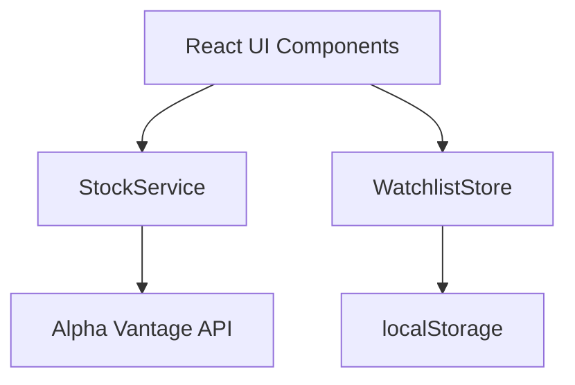

# Design Document: Stock Tracker

## Overview

אפליקציית React + TypeScript למתחילים בשוק ההון. המטרה היא לאפשר לאנשים שאינם מכירים כלל את עולם המניות להתחיל לעקוב אחר חברות ולהבין את הנתונים שהם רואים. כל מדד פיננסי מלווה בהסבר פשוט בעברית, וממשק המשתמש מעוצב להיות ידידותי ולא מאיים.

האפליקציה שולפת נתונים מ-[Alpha Vantage API](https://www.alphavantage.co/) (חינמי, 25 בקשות/יום בחינם), מציגה מחירים ומדדים עם הסברים, ומאפשרת ניהול רשימת מעקב אישית עם שמירה ב-localStorage.

## Architecture



**Stack:**
- React 18 + TypeScript
- Vite (build tool)
- Jest + fast-check (testing)
- CSS Modules (styling)

## Components and Interfaces

### StockService

אחראי על כל התקשורת עם ה-API החיצוני.

```typescript
interface StockQuote {
  ticker: string;
  companyName: string;
  price: number;
  change: number;       // שינוי מוחלט
  changePercent: number; // שינוי באחוזים
  volume: number;
}

interface SearchResult {
  ticker: string;
  companyName: string;
}

interface StockServiceError {
  code: 'NOT_FOUND' | 'NETWORK_ERROR' | 'API_ERROR' | 'INVALID_INPUT';
  message: string;
}

type Result<T> = { ok: true; data: T } | { ok: false; error: StockServiceError };

interface IStockService {
  searchStocks(query: string): Promise<Result<SearchResult[]>>;
  getQuote(ticker: string): Promise<Result<StockQuote>>;
}
```

### WatchlistStore

אחראי על שמירה וטעינה של רשימת המעקב.

```typescript
interface IWatchlistStore {
  getWatchlist(): string[];           // מחזיר רשימת tickers
  addTicker(ticker: string): void;
  removeTicker(ticker: string): void;
  hasTicker(ticker: string): boolean;
}
```

### React Components

```
App
├── SearchBar          - שדה חיפוש + תוצאות + טיפ על ticker
├── GlossaryPanel      - מילון מונחים נגיש מהניווט
├── DailyTip           - טיפ יומי למתחילים במסך הבית
├── WatchlistView      - תצוגת רשימת המעקב + הסבר בראש הדף
│   └── StockCard      - כרטיס מניה עם מחיר + שינוי יומי
└── StockDetail        - תצוגת פרטי מניה מלאים
    ├── MetricWithTooltip  - מדד + הסבר בעברית פשוטה
    └── PerformanceSummary - משפט סיכום ביצועים יומיים
```

**עקרון מנחה לעיצוב ה-UI:** כל מדד פיננסי (מחיר, שינוי, נפח) מוצג עם `MetricWithTooltip` — רכיב שמציג את הערך ולצידו אייקון `ℹ️` שבריחוף מציג הסבר בעברית פשוטה.

## Data Models

### StockQuote
| שדה | סוג | תיאור |
|-----|-----|--------|
| ticker | string | סמל המניה (לא ריק) |
| companyName | string | שם החברה |
| price | number | מחיר נוכחי (חיובי) |
| change | number | שינוי יומי מוחלט |
| changePercent | number | שינוי יומי באחוזים |
| volume | number | נפח מסחר (אי-שלילי) |

**אינווריאנטים:**
- `price > 0`
- `volume >= 0`
- `ticker.length > 0`

### WatchlistStore — localStorage schema
```json
{
  "watchlist": ["AAPL", "TSLA", "MSFT"]
}
```

## Correctness Properties

*A property is a characteristic or behavior that should hold true across all valid executions of a system — essentially, a formal statement about what the system should do. Properties serve as the bridge between human-readable specifications and machine-verifiable correctness guarantees.*

### Property-Based Testing Overview

נשתמש ב-[fast-check](https://github.com/dubzzz/fast-check) לבדיקות property-based ב-TypeScript. כל בדיקה תרוץ לפחות 100 איטרציות.

---

Property 1: Watchlist add/remove round trip
*For any* ticker string and initial watchlist state, adding the ticker and then removing it should leave the watchlist identical to its original state.
**Validates: Requirements 3.1, 3.2**

---

Property 2: Watchlist no duplicates
*For any* ticker string, adding the same ticker to the watchlist multiple times should result in the ticker appearing exactly once in the list.
**Validates: Requirements 3.3**

---

Property 3: Watchlist persistence round trip
*For any* list of ticker strings, saving the watchlist to localStorage and then loading it should return an equivalent list with the same tickers.
**Validates: Requirements 3.4, 3.5**

---

Property 4: StockQuote rendering completeness
*For any* valid StockQuote object, the rendered StockCard component should contain the ticker symbol, company name, price, change value, change percentage, and volume.
**Validates: Requirements 2.1, 2.4**

---

Property 5: Price color invariant
*For any* StockQuote with a positive change value, the rendered component should apply a "positive" CSS class; for any StockQuote with a negative change value, it should apply a "negative" CSS class.
**Validates: Requirements 2.5**

---

Property 6: Search whitespace rejection
*For any* string composed entirely of whitespace characters (including empty string), calling `searchStocks` should return `{ ok: false, error: { code: 'INVALID_INPUT' } }`.
**Validates: Requirements 1.3**

---

Property 7: API error always returns structured Result
*For any* HTTP error response from the external API, the StockService should return `{ ok: false, error: StockServiceError }` — never throw an exception and never return `{ ok: true }`.
**Validates: Requirements 5.2, 2.3**

---

## Error Handling

| שגיאה | קוד | טיפול ב-UI |
|-------|-----|------------|
| ticker לא קיים | `NOT_FOUND` | הודעה + אפשרות לחיפוש חדש |
| רשת לא זמינה | `NETWORK_ERROR` | הודעת offline + כפתור retry |
| שגיאת API | `API_ERROR` | הודעת שגיאה + כפתור retry |
| קלט לא תקין | `INVALID_INPUT` | הודעת validation מתחת לשדה |

כל שגיאה מוחזרת כ-`Result<T>` — אין זריקת exceptions מ-StockService.

## Testing Strategy

### Unit Tests (Jest)
- `WatchlistStore`: add, remove, hasTicker, persistence
- `StockService`: parsing תגובות API, טיפול בשגיאות
- Components: rendering נכון של מצבי loading/error/success

### Property-Based Tests (fast-check, מינימום 100 איטרציות)
- כל property מהרשימה למעלה ממומש כבדיקה אחת
- Tag format: `// Feature: stock-tracker, Property N: <property_text>`

### Testing Configuration
```typescript
// jest.config.ts
export default {
  preset: 'ts-jest',
  testEnvironment: 'jsdom',
};
```
